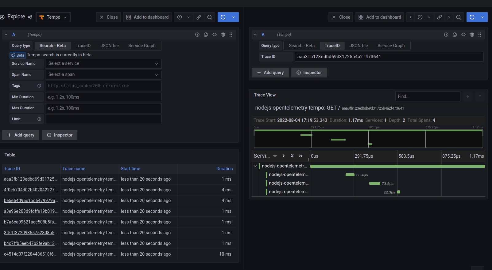

# node-otel-demo

- `docker-compose up`
- `curl http://localhost:8080` <-- do this a bunch
- open `http://localhost:3000`
  - navigate to Tempo explore
  - execute an empty query

# Note

otel instrumentation has been downgraded to 0.28.0 to be compatiable with agent